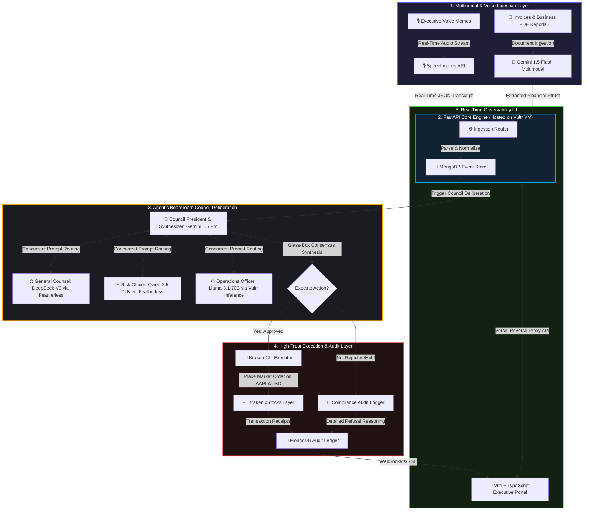

# 🌌 Vantage-Point 2.0: Autonomous Enterprise Treasury Engine

**Vantage-Point 2.0** is a state-of-the-art, AI-native autonomous corporate treasury engine built for the **AI Agent Olympics Hackathon**. It directly solves the **$1.2 Trillion SMB Cash Drag** by transforming idle corporate capital into yield-bearing assets through an agentic boardroom council orchestration and real-time execution.

🟢 **Live Production Link (Vultr-Hosted):** [http://216.128.155.55](http://216.128.155.55)  
🟢 **Frontend Portal (Vercel Proxy):** [https://actionpilot-six.vercel.app](https://actionpilot-six.vercel.app)

---

## 🏛️ Comprehensive Architecture Deep-Dive

Vantage-Point 2.0 implements a **Collaborative Agentic System** that moves beyond simple copilots into a high-trust, resilient, multi-agent boardroom council. It manages corporate float, audits decisions for strict regulatory compliance, assesses macro risk, and programmatically executes trades.

### 🔄 End-to-End System Data Flow



---

## 🧠 The Agentic Boardroom Council

To guarantee enterprise-grade safety, Vantage-Point employs four highly specialized, autonomous agents that coordinate concurrently:

| Role | Agent Persona | Model Stack | Delivery Channel | Responsibility |
| :--- | :--- | :--- | :--- | :--- |
| **🦁 President & CEO** | Executive Decision Maker | `gemini-1.5-pro` / `gemini-1.5-flash` | Google AI Studio | Aggregates all council feedback, performs advanced contextual synthesis, resolves conflicts, and generates the final structured execution payload. |
| **⚖️ General Counsel** | Compliance & Legal Audit | `deepseek-ai/DeepSeek-V3` | Featherless API | Audits the trade against active enterprise risk rules, checks compliance against corporate policies, and flags regulatory roadblocks. |
| **📉 Risk Officer** | Macro Volatility & Risk Analyst | `Qwen/Qwen2.5-72B-Instruct` | Featherless API | Computes market volatility, calculates max drawdown tolerances, and verifies trade sizes against current treasury float. |
| **⚙️ Operations Officer** | Infrastructure & Cloud Systems | `llama-3.1-70b-instruct-fp8` | **Vultr Serverless Inference** | Assesses operational network status, verifies connection latency, confirms execution node health, and ensures maximum system uptime. |

### 🤝 The Consensus Consensus Algorithm

When an ingestion event occurs:
1. The **FastAPI Backend Router** concurrently distributes the event context to the **General Counsel**, **Risk Officer**, and **Operations Officer**.
2. Each specialized agent executes its contextual prompt structure and returns a dedicated reasoning payload.
3. The **CEO Agent** ingests the raw transcripts of the three agents, performs cross-reasoning analysis, and outputs a strict JSON structure:
   ```json
   {
     "decision": "BUY" | "SELL" | "HOLD",
     "symbol": "AAPLx/USD",
     "volume": 0.01,
     "consensus_score": 0.92,
     "glass_box_reasoning": "...",
     "individual_agent_votes": {
       "general_counsel": "APPROVED",
       "risk_officer": "APPROVED",
       "operations_officer": "APPROVED"
     }
   }
   ```
4. If a single agent raises a high-severity regulatory or operational warning, the **CEO Agent** halts execution and logs the comprehensive reasoning trail for human-in-the-loop review.

---

## 🏆 Partner Challenge Integrations

Vantage-Point 2.0 is specifically designed to unite all five sponsor technologies into an elite, production-ready system:

### 1. ☁️ Vultr (High-Performance Cloud Infrastructure & Serverless Inference)
* **Production Hosting**: The FastAPI backend, React web portal (via Dockerized Nginx), and high-performance MongoDB instance are hosted in a secure, unified Docker virtual network on a Vultr VM.
* **Serverless Inference Integration**: The **Operations Officer** agent communicates directly with Vultr's Serverless Inference endpoint (`https://api.vultrinference.com/v1`) using the optimized `llama-3.1-70b-instruct-fp8` model.
* **Strict Network Security**: Fully hardened via Vultr's **API Access Control IP Whitelisting** (`216.128.155.55/32` CIDR subnet), restricting communication strictly to authenticated host endpoints.

### 2. 🧠 Google Gemini (Advanced Reasoning & Multimodal Context)
* **Orchestration & CEO**: Utilizes `gemini-1.5-pro`'s massive context window to synthesize extensive boardroom transcripts and cross-examine reasoning.
* **Multimodal Invoice Processing**: Ingests physical paper invoices, PDF reports, and spreadsheets directly via image embedding. Exposes visual and semantic context to the boardroom to identify billing spikes or early-payment discount opportunities.

### 3. 🐙 Kraken (Programmatic Tokenized Stock Execution - xStocks)
* **Execution Gateway**: Communicates with the `kraken` trading CLI installed on the Vultr host container.
* **xStocks Focus**: Autonomously trades tokenized real-world equities (specifically `AAPLx/USD` tokenized Apple shares) to harvest corporate yield from idle company capital without leaving the blockchain layer.
* **Programmatic Order Routing**: Features defensive checks for order depth, minimum lot sizes, and slippage tolerance before piping arguments to the Kraken CLI.

### 4. 🪶 Featherless (Decentralized Open-Source Model Deployment)
* **Enterprise Specialty Agents**: Connects directly to the Featherless API to call highly advanced, open-source models:
  * `deepseek-ai/DeepSeek-V3` for deep legal and logical compliance verification.
  * `Qwen/Qwen2.5-72B-Instruct` for quantitative risk analysis.
* **High-Throughput Parallel Processing**: Leverages Featherless' serverless infrastructure to query both models concurrently, maintaining an ultra-low execution latency profile.

### 5. 🎙️ Speechmatics (Voice-First Enterprise Ingestion)
* **Real-time Audio Stream**: Captures executive speech or voice commands directly from the dashboard mic.
* **Precision Transcription**: Speechmatics transcribes unstructured audio in real-time, mapping voice notes into a structured "Float Event" to trigger boardroom deliberations autonomously.

---

## 💾 Database Schema & Audit Trail

Vantage-Point 2.0 utilizes **MongoDB** to record every step of the decision pipeline for strict SOX compliance. 

### 1. `meetings` Collection
Tracks visual/voice boardroom syncs:
```json
{
  "_id": "ObjectId",
  "title": "Quarterly Liquidity Sync",
  "date": "2026-05-17",
  "status": "processed",
  "voice_transcript": "..."
}
```

### 2. `trades` Collection
Maintains an immutable record of autonomous trades:
```json
{
  "_id": "ObjectId",
  "order_id": "PAPER-CA463BE1",
  "symbol": "AAPLx/USD",
  "side": "buy",
  "volume": 0.01,
  "price": 175.42,
  "timestamp": "2026-05-17T11:23:07Z",
  "status": "filled",
  "reasoning": "Macro treasury optimization triggered by Qwen risk models.",
  "consensus_votes": {
    "ceo": "BUY",
    "general_counsel": "APPROVE",
    "risk_officer": "APPROVE",
    "operations_officer": "APPROVE"
  }
}
```

---

## 🛠️ Installation & Deployment

Vantage-Point 2.0 is fully containerized and easily deployable in seconds.

### ⚡ 1-Line Autonomous Server Provisioning
On a fresh Ubuntu 24.04 Vultr Instance, run:
```bash
curl -sSL https://raw.githubusercontent.com/rasali535/vantage_point/main/vultr-init.sh | sudo bash
```
This script automatically provisions Docker, pulls the codebase, configures Nginx, and launches the entire multi-agent stack.

### 🐳 Manual Setup
1. **Clone the Repository:**
   ```bash
   git clone https://github.com/rasali535/vantage_point.git
   cd vantage_point
   ```
2. **Configure Environment variables:**
   Create a `.env` in the root directory:
   ```env
   # API Keys
   GEMINI_API_KEY=your_gemini_key
   FEATHERLESS_API_KEY=your_featherless_key
   VULTR_INFERENCE_API_KEY=your_vultr_inference_key
   SPEECHMATICS_API_KEY=your_speechmatics_key
   MONGODB_URL=mongodb+srv://...
   
   # Trading
   KRAKEN_API_KEY=your_kraken_key
   KRAKEN_API_SECRET=your_kraken_secret
   ```
3. **Build & Boot Containers:**
   ```bash
   docker compose up --build -d
   ```

---

## 🎨 Premium Dashboard Experience
The React portal features an ultra-premium **glassmorphism user interface** optimized for C-level executive oversight. It provides:
* **Real-time Deliberation Terminal**: Live visualization of the boardroom agents actively voting and cross-examining arguments.
* **Voice-Trigger Module**: Instantly submit live audio messages processed by Speechmatics.
* **Portfolio Visualizer**: Track holdings in `AAPLx/USD` tokenized stock, complete with real-time profit and loss (P&L) tracking and live transaction history.

---

### 🛡️ Compliance & Safety first
> [!IMPORTANT]
> Vantage-Point 2.0 incorporates strict safety controls. Every agent has a dedicated fallback engine. If an LLM endpoint fails, the systems gracefully fall back to highly conservative mock-data engines and alert the treasury officer, preventing random execution state issues or 500 API responses.

***

*Built with absolute precision and state-of-the-art AI orchestration by **Ras Ali Labs** for the **AI Agent Olympics Hackathon**.*