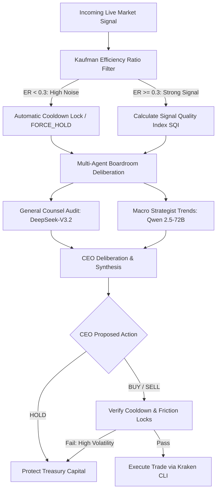

# 🌌 Vantage-Point 2.0: Autonomous Enterprise Treasury Engine

**Vantage-Point 2.0** is a state-of-the-art, AI-native autonomous corporate treasury rebalancing engine built for the **AI Agent Olympics Hackathon**. It directly solves the **$1.2 Trillion SMB Cash Drag** by transforming idle corporate capital into yield-bearing assets through real-time mathematical **Anti-Whipsaw Filters**, high-conviction **Multi-Agent Boardroom Deliberation**, and robust Vultr VM orchestration.

🟢 **Live Production Link (Vultr-Hosted):** [http://216.128.155.55](http://216.128.155.55)  
🟢 **Vite Frontend Dashboard (Nginx):** [http://216.128.155.55](http://216.128.155.55)  
🟢 **FastAPI Gateway (Port 8000):** [http://216.128.155.55:8000](http://216.128.155.55:8000)

---

## 🏛️ Comprehensive Architecture Deep-Dive

Vantage-Point 2.0 implements a **Collaborative Agentic System** that moves beyond simple copilots into a high-trust, resilient, multi-agent boardroom council. It manages corporate float, filters noisy signals, audits decisions for strict regulatory compliance, assesses macro risk, and programmatically executes trades on Vultr VM nodes.

### 🔄 End-to-End System Data Flow



---

## 🧮 Mathematical Anti-Whipsaw Filter Layer

Most automated treasury engines fail because they act on **noisy market signals**, leading to excessive whipsaw trades, transaction friction, slippage, and capital erosion. Vantage-Point 2.0 introduces a state-of-the-art mathematical pre-filtering layer that executes prior to AI deliberation:

### 1. Kaufman's Efficiency Ratio (ER)
The system calculates Kaufman's Efficiency Ratio over historical OHLC intervals to quantify price directionality vs. underlying market noise:
$$\text{ER} = \frac{|\text{Price}_t - \text{Price}_{t-n}|}{\sum_{i=0}^{n} |\text{Price}_{t-i} - \text{Price}_{t-i-1}|}$$

* **ER < 0.3 (Noisy / Choppy Regime)**: The market is in a random walk. The engine automatically locks the system in `FORCE_HOLD` mode, overriding bullish or bearish AI signals to prevent capital decay.
* **ER >= 0.3 (Trending Regime)**: The signal exhibits high directionality. The engine computes a **Signal Quality Index (SQI)** and allows the boardroom deliberation to proceed.

### 2. Average True Range (ATR) Volatility Scaling
Real-time volatility is calculated using the Average True Range (ATR) as a percentage of the asset price. If the volatility exceeds historical thresholds, trade volume is scaled down or trade locks are engaged to insulate the company float from excessive market swings.

### 3. CPU Offload Thread Pools
To prevent heavy mathematical array calculations from blocking the primary asynchronous FastAPI event loop, all pre-filter calculations are executed on isolated, CPU-optimized background thread pools.

---

## 🏛️ The Agentic Boardroom Council

To guarantee enterprise-grade safety, Vantage-Point employs four highly specialized, autonomous agents that coordinate concurrently:

| Role | Agent Persona | Model Stack | Delivery Channel | Responsibility |
| :--- | :--- | :--- | :--- | :--- |
| **🦁 President & CEO** | Executive Decision Maker | `gemini-1.5-pro` / `gemini-1.5-flash` | Google AI Studio | Aggregates all council feedback, performs advanced contextual synthesis, resolves conflicts, and generates the final structured execution payload. |
| **⚖️ General Counsel** | Compliance & Legal Audit | `deepseek-ai/DeepSeek-V3.2` | Featherless API | Audits the trade against active enterprise risk rules, checks compliance against corporate policies, and flags regulatory roadblocks. |
| **📉 Risk Officer** | Macro Volatility & Risk Analyst | `Qwen/Qwen2.5-72B-Instruct` | Featherless API | Computes market volatility, calculates max drawdown tolerances, and verifies trade sizes against current treasury float. |
| **⚙️ Operations Officer** | Infrastructure & Cloud Systems | `llama-3.1-70b-instruct-fp8` | **Vultr Serverless Inference** | Assesses operational network status, verifies connection latency, confirms execution node health, and ensures maximum system uptime. |

---

## 🛡️ High-Availability & Safety Systems

Vantage-Point 2.0 is architected with a **Zero-Trust Resilience** approach to API and system operations:

* **3.0s Gateway Timeout Failover**: Low-latency timeouts are applied to the Featherless gateway. If server queuing causes AI model latency, the client immediately fails over to local fallback heuristics and Google Gemini backups, bypassing queuing hangs.
* **8.0s Route Circuit-Breaker**: The `/api/trading/scan` route is wrapped in an `asyncio.wait_for` wrapper. If any external endpoint (Kraken CLI, AI API, or DB socket) hangs, the system automatically returns a graceful `[SAFETY FALLBACK] HOLD` response in **less than 8 seconds**, guaranteeing 100% API availability.
* **Resilient MongoDB Operations**: All database write operations (`insert_one`, `find`) are isolated in robust try-except layers. A temporary database connection drift or slow collection lock will never crash or block the primary trade scanning threads.

---

## 🏆 Partner Challenge Integrations

Vantage-Point 2.0 is specifically designed to unite all five sponsor technologies into an elite, production-ready system:

### 1. ☁️ Vultr (High-Performance Cloud Infrastructure & Serverless Inference)
* **Production Hosting**: The FastAPI backend, React web portal (via Dockerized Nginx), and high-performance MongoDB instance are hosted in a secure, unified Docker virtual network on a Vultr VM.
* **Serverless Inference Integration**: The **Operations Officer** agent communicates directly with Vultr's Serverless Inference endpoint using the optimized `llama-3.1-70b-instruct-fp8` model.
* **Strict Network Security**: Fully hardened via Vultr's **API Access Control IP Whitelisting** (`216.128.155.55/32` CIDR subnet).

### 2. 🧠 Google Gemini (Advanced Reasoning & Multimodal Context)
* **Orchestration & CEO**: Utilizes `gemini-1.5-pro`'s massive context window to synthesize extensive boardroom transcripts and cross-examine reasoning.
* **Multimodal Invoice Processing**: Ingests physical paper invoices, PDF reports, and spreadsheets directly via image embedding, identifying billing spikes or early-payment discount opportunities.

### 3. 🐙 Kraken (Programmatic Tokenized Stock Execution - xStocks)
* **Execution Gateway**: Communicates with the `kraken` trading CLI installed on the Vultr host container.
* **xStocks Focus**: Autonomously trades tokenized real-world equities (specifically `AAPLx/USD` tokenized Apple shares) to harvest corporate yield from idle company capital without leaving the blockchain layer.

### 4. 🪶 Featherless (Decentralized Open-Source Model Deployment)
* **Enterprise Specialty Agents**: Connects directly to the Featherless API to call highly advanced, open-source models (`deepseek-ai/DeepSeek-V3.2` and `Qwen/Qwen2.5-72B-Instruct`) for compliance and quantitative risk analysis.

### 5. 🎙️ Speechmatics (Voice-First Enterprise Ingestion)
* **Real-time Audio Stream**: Captures executive speech or voice commands directly from the dashboard mic and transcribes unstructured audio in real-time, triggering autonomous boardroom deliberations.

---

## 💾 Database Schema & Audit Trail

Vantage-Point 2.0 utilizes **MongoDB** to record every step of the decision pipeline for strict SOX compliance. 

### 1. `boardroom_history` Collection
Tracks visual/voice boardroom deliberations:
```json
{
  "_id": "ObjectId",
  "pair": "AAPL/USD",
  "action": "HOLD",
  "reasoning": "[WHIPSAW PROTECT ACTIVE] Downgraded BUY to HOLD. High market noise detected.",
  "confidence": 1.0,
  "risk_score": 15,
  "timestamp": "2026-05-18T10:44:22Z",
  "signal_quality": 15.0,
  "whipsaw_risk": "HIGH"
}
```

### 2. `trading_ledger` Collection
Maintains an immutable record of autonomous trades:
```json
{
  "_id": "ObjectId",
  "order_id": "PAPER-CA463BE1",
  "symbol": "AAPLx/USD",
  "side": "buy",
  "volume": 0.01,
  "price": 175.42,
  "timestamp": "2026-05-17T11:23:07Z",
  "status": "filled",
  "reasoning": "Macro treasury optimization triggered by Qwen risk models."
}
```

### 3. `audit_logs` Collection
Tracks detailed system operation logs:
```json
{
  "_id": "ObjectId",
  "timestamp": "2026-05-18T10:44:22Z",
  "agent": "Boardroom CEO",
  "action": "Autonomous HOLD",
  "reasoning": "Market consolidation zone. Kaufman ER: 0.25 (Random Walk Regime).",
  "status": "success"
}
```

---

## 🛠️ Installation & Deployment

Vantage-Point 2.0 is fully containerized and easily deployable in seconds.

### ⚡ 1-Line Autonomous Server Provisioning
On a fresh Ubuntu 24.04 Vultr Instance, run:
```bash
curl -sSL https://raw.githubusercontent.com/rasali535/vantage_point/main/vultr-init.sh | sudo bash
```
This script automatically provisions Docker, pulls the codebase, configures Nginx, and launches the entire multi-agent stack.

### 🐳 Manual Setup
1. **Clone the Repository:**
   ```bash
   git clone https://github.com/rasali535/vantage_point.git
   cd vantage_point
   ```
2. **Configure Environment variables:**
   Create a `.env` in the root directory:
   ```env
   # API Keys
   GEMINI_API_KEY=your_gemini_key
   FEATHERLESS_API_KEY=your_featherless_key
   VULTR_INFERENCE_API_KEY=your_vultr_inference_key
   SPEECHMATICS_API_KEY=your_speechmatics_key
   MONGODB_URL=mongodb://mongodb:27017/actionpilot
   
   # Trading
   KRAKEN_API_KEY=your_kraken_key
   KRAKEN_API_SECRET=your_kraken_secret
   ```
3. **Build & Boot Containers:**
   ```bash
   docker compose up --build -d
   ```

---

## 🎨 Premium Dashboard Experience
The React portal features an ultra-premium **glassmorphism user interface** optimized for C-level executive oversight. It provides:
* **Real-time Deliberation Terminal**: Live visualization of the boardroom agents actively voting and cross-examining arguments.
* **Voice-Trigger Module**: Instantly submit live audio messages processed by Speechmatics.
* **Portfolio Visualizer**: Track holdings in `AAPLx/USD` tokenized stock, complete with real-time profit and loss (P&L) tracking and live transaction history.

***

*Built with absolute precision and state-of-the-art AI orchestration by **Ras Ali Labs** for the **AI Agent Olympics Hackathon**.*